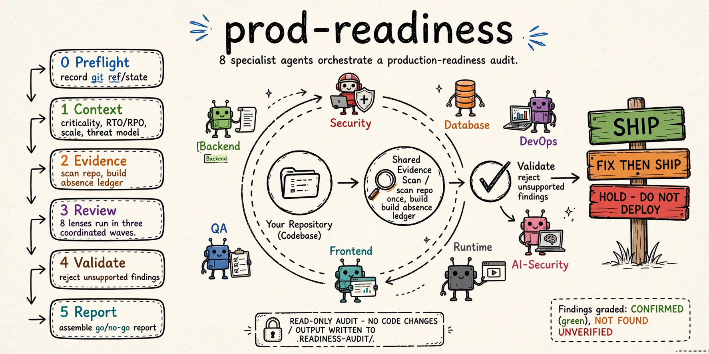

# prod-readiness



**Production readiness and adversarial code-review skill for Claude Code and AI-generated apps. Audit security, tests, reliability, deployment risks, and launch blockers before you ship.**

`prod-readiness` is a read-only, whole-repository audit for the question that
matters after a prototype works: **is this safe to launch?** It produces an
evidence-backed go/no-go report across security, backend, database, DevOps, QA,
frontend, and AI-security concerns.

It is for a production-readiness review, not a quick PR review or a code-style
pass. The skill looks for the systems that commonly fail after launch: missing
controls, untested recovery paths, unsafe trust boundaries, weak test coverage,
and operational blind spots.

## What you get

- A production readiness checklist tailored to the repository and its context.
- One shared evidence pass, reused by up to seven specialist review lenses.
- An absence ledger that distinguishes **confirmed**, **not found**, and
  **unverified** controls.
- A validated, CTO-readable verdict: **SHIP**, **FIX THEN SHIP**, or
  **HOLD - DO NOT DEPLOY**.
- A persistent audit trail under `.readiness-audit/`, safe to resume after a
  cleared session or interruption.

## Set it up once

You only need **Claude Code** installed on your computer. You do not need to
download, clone, or keep a copy of this repository.

### First-time setup

1. Open Claude Code.

   If you normally use Terminal, open it and type:

   ```bash
   claude
   ```

2. Add this GitHub marketplace. Copy this line into Claude Code and press
   Enter:

   ```text
   /plugin marketplace add Taimoorkhan1122/prod-readiness
   ```

   Claude Code downloads the marketplace directly from GitHub.

3. Install the plugin by copying this line into Claude Code and pressing Enter:

   ```text
   /plugin install prod-readiness@prod-readiness-marketplace
   ```

4. Turn it on now by copying this line into Claude Code and pressing Enter:

   ```text
   /reload-plugins
   ```

That is it. You only need to do these four steps once. The plugin will be
available in future Claude Code sessions.

## Use it on a project

1. Open Claude Code in the folder for the app or website you want to check.
2. Ask a plain-English question, such as:

   > Is this ready for production?

   > What needs fixing before I launch this app?

   > Is this AI-generated app safe to put in front of real users?

3. Answer the audit's questions about your app. It will then review the project
   and give you a go/no-go report.

The audit only reads your project. It does not change your source code or
publish anything.

## Optional: use a local copy while developing

If you are changing this plugin yourself, you can run it from a local folder
without installing it:

```bash
cd /path/to/project-you-want-to-check
claude --plugin-dir /absolute/path/to/prod-readiness
```

This temporary option ends when you close Claude Code.

## Optional: manage the installation

To remove the plugin later, open Claude Code and enter:

```text
/plugin uninstall prod-readiness@prod-readiness-marketplace
```

If you edit the plugin files yourself, enter `/reload-plugins` in Claude Code
to use the latest changes.

## How the audit works

```text
Stage 0  Preflight    Record the git ref, working-tree state, and resume point
Stage 1  Context      Set criticality, RTO/RPO, scale, threat model, and scope
Stage 2  Evidence     Scan the repository and create an absence ledger
Stage 3  Review       Run read-only specialist lenses in two coordinated waves
Stage 4  Validate     Reject findings that do not meet evidence rules
Stage 5  Report       Assemble the go/no-go report and remaining judgement
```

The seven lenses cover security, backend, database, DevOps, QA, frontend, and
AI security. Lenses with no signal are explicitly skipped rather than inventing
findings.

## Evidence, not confident guesses

Production-readiness audits often confuse three different states:

| State | Meaning |
| --- | --- |
| `CONFIRMED` | The control or risk was proven from evidence in scope. |
| `NOT FOUND` | The repository was searched for the control and the audit can support its absence. |
| `UNVERIFIED` | The control may exist outside the reviewed scope, so source silence proves nothing. |

`absence_probe.py` runs deterministic control probes and records the patterns,
hit counts, and paths in an absence ledger. `validate_findings.py` blocks the
report when a finding makes a claim its evidence cannot support.

This is especially important for deployment and operations concerns. A missing
backup configuration in application code is normally **unverified**; the same
silence in repository-owned infrastructure-as-code can become **not found**.

## Design principles

**One evidence pass, seven evaluations.** The repository is scanned once. Every
specialist lens works from that same evidence pack, reducing cost and avoiding
contradictory claims.

**Read-only audit.** The skill does not alter source, configuration, tests, or
dependencies. It writes only the audit trail under `.readiness-audit/`.

**Context controls severity.** A missing rate limiter means something different
for a public payments API than for an internal VPN-only tool. The audit captures
criticality, scale, recovery expectations, and threat model before judging risk.

**Audit, then stop.** Findings are not silently fixed. Use a separate,
approval-gated remediation workflow when you are ready to change the code.

## Audit output

```text
.readiness-audit/
├── context.md                    # criticality, RTO/RPO, scale, threat model
├── scope.md                      # reviewed and excluded systems
├── evidence/
│   ├── inventory.json            # discovered repository facts
│   ├── absence-ledger.{json,md}  # deterministic control probes
│   └── map.md                    # architecture and trust boundaries
├── findings/<lens>.md            # one file per specialist lens
├── deferred.md                   # controls not yet applicable
└── report.md                     # validated production-readiness verdict
```

Consider adding `.readiness-audit/` to `.gitignore` unless you intentionally
want audit records checked into version control.

## Tune the audit

Add a control by appending a `C(...)` entry to `CONTROLS` in
`scripts/absence_probe.py`. Add it to `REQUIRES` when it applies only if another
system exists. Every applicable lens receives the new control through the shared
ledger.

To pin a model for a lens, set `model: haiku` or `model: sonnet` in that agent's
frontmatter. The default is `inherit`.

## Repository layout

```text
.claude-plugin/plugin.json
agents/lens-{security,backend,frontend,devops,qa,database,ai-security}.md
skills/production-readiness-audit/
  SKILL.md
  references/{context-intake,lens-dispatch,finding-format,report-writing}.md
scripts/
  audit_state.py
  evidence_scan.py
  absence_probe.py
  validate_findings.py
  assemble_report.py
```
